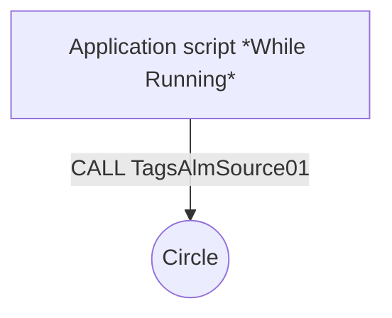
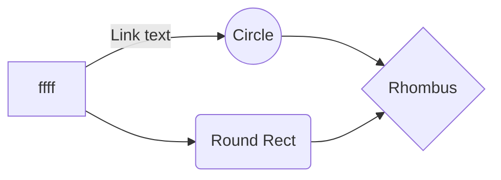

### 1. Генерация массивов

```python
  iniTagsSource;12;4;1;SHSU2_2_AI1_1;Давление в трубопроводе (2.2 PT01);МПа;/pv/::DCS2_2:AI[1,1];;28;DCS2_2;503;stdPrecisionPress;5;;0;SHSU2_2_AI1_2;Температура в трубопроводе (2.2 TT01);°С;/pv/::DCS2_2:AI[1,2];;28;DCS2_2;503;stdPrecisionTemp;5;;0;SHSU2_2_AI1_3;Температура в трубопроводе (2.2 TT02);°С;/pv/::DCS2_2:AI[1,3];;28;DCS2_2;503;stdPrecisionTemp;5;;0;SHSU2_2_AI1_6;Загазованность блока (2.2AG01);%;/pv/::DCS2_2:AI[1,6];;28;DCS2_2;503;stdPrecisionTemp;5;;0;
``` 

- iniTagsSource 
  - *sName = SAGS_XY("iniTagsSource", 0, YY);             // Префикс названия тега* 
  - *sComment = SAGS_XY("iniTagsSource", 1, YY);  // Комментарий*
  - *sEU = SAGS_XY("iniTagsSource", 2, YY);       // Ед. изм*
  - *sAddressPrefix = SAGS_XY("iniTagsSource", 3, YY);       // Префикс адреса*
  - *iAddressBase = SAGS_XY("iniTagsSource", 4, YY);       // Базовый адрес*
  - *iType = SAGS_XY("iniTagsSource", 5, YY);       // Тип*
  - *sAlarmGroups = SAGS_XY("iniTagsSource", 6, YY);       // Группа алармов*
  - *iSettings = SAGS_XY("iniTagsSource", 7, YY);       // Битовые настройки*
  - *sSettings = SAGS_XY("iniTagsSource", 7, YY);       // Битовые настройки*
  - *iPrecision = SAGS_XY("iniTagsSource", 8, YY);       // Кол-во знаков*
  - *iDeadband = SAGS_XY("iniTagsSource", 9, YY);       // Зона неч-ти*
  - *iNumInfoMsg = SAGS_XY("iniTagsSource", 10, YY);       // Обработка инф. сигналов*
  - *sNumInfoMsg = SAGS_XY("iniTagsSource", 10, YY);       // Обработка инф. сигналов*
- iniTagsSettingsType (INDEX-столбец в типе переменной, ROW-строка в типе переменной, TYPE-номер типа переменной z)
  - *sName = SAGI_XYZ("iniTagsSettingsType", INDEX, ROW, TYPE);* 
- iniTagsBit
- iniTagsChange
- iniTagsInt
- iniTagsAnalog

### 2. Добавление файла iniTags.csv в инициализацию Интача
*Копируем файл iniTags.csv в папку Variables в проекте*

*В Application Script (Startup) добавляем строчку*
```python
IF SLOAD("iniTags.csv", 1 ) <> 0 THEN		stdInit = 1; ELSE	stdInit = -1; MessageBox( "Не найден файл инициализации iniTags.csv!", "Ошибка инициализации",  0 );		ENDIF;
``` 

### 3. Создание скрипта TagsAlmSource01( ) в QuickFunctions  
  
```python
  TT03_Mode.AlarmUserDefNum2 = CALL TagsAlmAnalogNewPlc( 24, 14, 0, TT03_Mode.Quality, TT03_Mode, TT03_Mode.AlarmUserDefNum2, TT03_LoLo, TT03_Lo, TT03_Hi, TT03_HiHi, TT03, TT03_Settings);
``` 
  
  *TagsAlmAnalogNewPlc(PARAM, TYPE, INDEX, QUAL, rMin, rMax, rWMin, rWMax, rAMin, rAMax, rVal, iStatus, iSettings) - функция генерации сообщений аналоговых параметров*
  - *PARAM as Integer - порядковый номер тега из массива iniTagsSource*
  - *TYPE as Integer - тип тега из генератора z*
  - *INDEX as Integer - номер столбца из типа переменной*
  - *QUAL as Integer - TT03.Quality*
  - *rMin as Real - TT03_mA_Lo*
  - *rMax as Real - TT03_mA_Hi*
  - *rWMin as Real - TT03_Lo*
  - *rWMax as Real - TT03_Hi*
  - *rAMin as Real - TT03_LoLo*
  - *rAMax as Real - TT03_HiHi*
  - *rVal as Real - TT03*
  - *iStatus as Integer - TT03.AlarmUserDefNum2*
  - *iSettings as Integer - TT03_Settings*


### TagsAlmSource01( )
```python
  TT03_Mode.AlarmUserDefNum2 = CALL TagsAlmAnalogNewPlc( 24, 14, 0, TT03_Mode.Quality, TT03_Mode, TT03_Mode.AlarmUserDefNum2, TT03_LoLo, TT03_Lo, TT03_Hi, TT03_HiHi, TT03, TT03_Settings);
``` 


CALL TagsAlmSource01( );

<details>
  <summary>
    TagsAlmSource01( )
  </summary> 
  - *sName = SAGS_XY("iniTagsSource", 0, YY);             // Префикс названия тега* 
  - *sComment = SAGS_XY("iniTagsSource", 1, YY);  // Комментарий*
</details>





