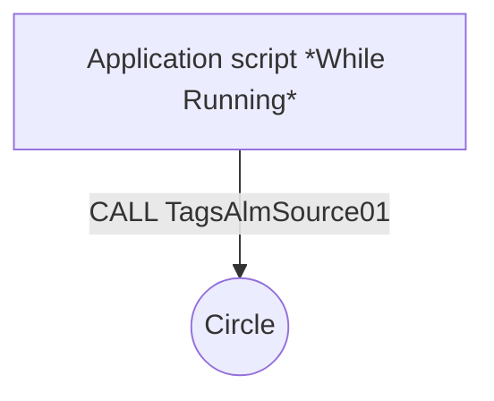
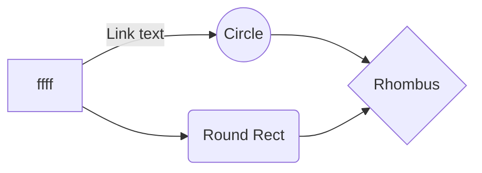

### Генерация массивов
- iniTagsSource 
  - *sName = SAGS_XY("iniTagsSource", 0, YY);     // Префикс названия тега*
  - *sComment = SAGS_XY("iniTagsSource", 1, YY);  // Комментарий*
  - *sEU = SAGS_XY("iniTagsSource", 2, YY);       // Ед. изм*
  - *sAddressPrefix = SAGS_XY("iniTagsSource", 3, YY);       // Префикс адреса*
  - *iAddressBase = SAGS_XY("iniTagsSource", 4, YY);       // Базовый адрес*
  - *iType = SAGS_XY("iniTagsSource", 5, YY);       // Тип*
  - *sAlarmGroups = SAGS_XY("iniTagsSource", 6, YY);       // Группа алармов*
  - *iSettings = SAGS_XY("iniTagsSource", 7, YY);       // Битовые настройки*
  - *sSettings = SAGS_XY("iniTagsSource", 7, YY);       // Битовые настройки*
  - *iPrecision = SAGS_XY("iniTagsSource", 8, YY);       // Кол-во знаков*
  - *iDeadband = SAGS_XY("iniTagsSource", 9, YY);       // Зона неч-ти*
  - *iNumInfoMsg = SAGS_XY("iniTagsSource", 10, YY);       // Обработка инф. сигналов*
  - *sNumInfoMsg = SAGS_XY("iniTagsSource", 10, YY);       // Обработка инф. сигналов*
- iniTagsSettingsType
- iniTagsBit
- iniTagsChange
- iniTagsInt
- iniTagsAnalog


### TagsAlmSource01( )
```python
  TT03_Mode.AlarmUserDefNum2 = CALL TagsAlmAnalogNewPlc( 24, 14, 0, TT03_Mode.Quality, TT03_Mode, TT03_Mode.AlarmUserDefNum2, TT03_LoLo, TT03_Lo, TT03_Hi, TT03_HiHi, TT03, TT03_Settings);
``` 


CALL TagsAlmSource01( );

<details>
  <summary>
    TagsAlmSource01( )
  </summary> ```Optional information to help a user be more successful.```
</details>





