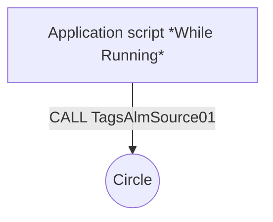
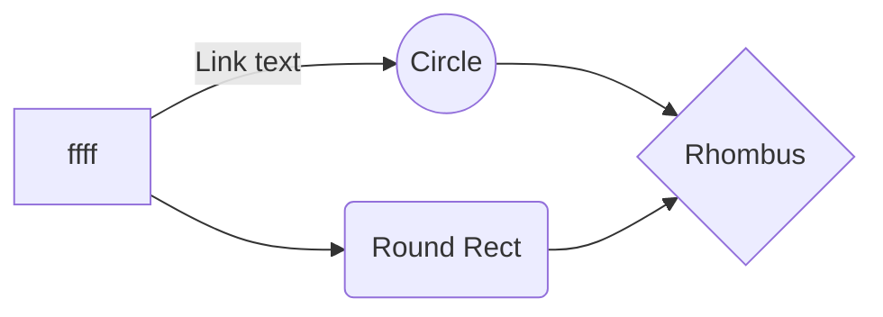

### TagsAlmSource01( )
```python
  TT03_Mode.AlarmUserDefNum2 = CALL TagsAlmAnalogNewPlc( 24, 14, 0, TT03_Mode.Quality, TT03_Mode, TT03_Mode.AlarmUserDefNum2, TT03_LoLo, TT03_Lo, TT03_Hi, TT03_HiHi, TT03, TT03_Settings);
``` 


CALL TagsAlmSource01( );

<details>
  <summary>
    TagsAlmSource01( )
  </summary> ```Optional information to help a user be more successful.```
</details>





